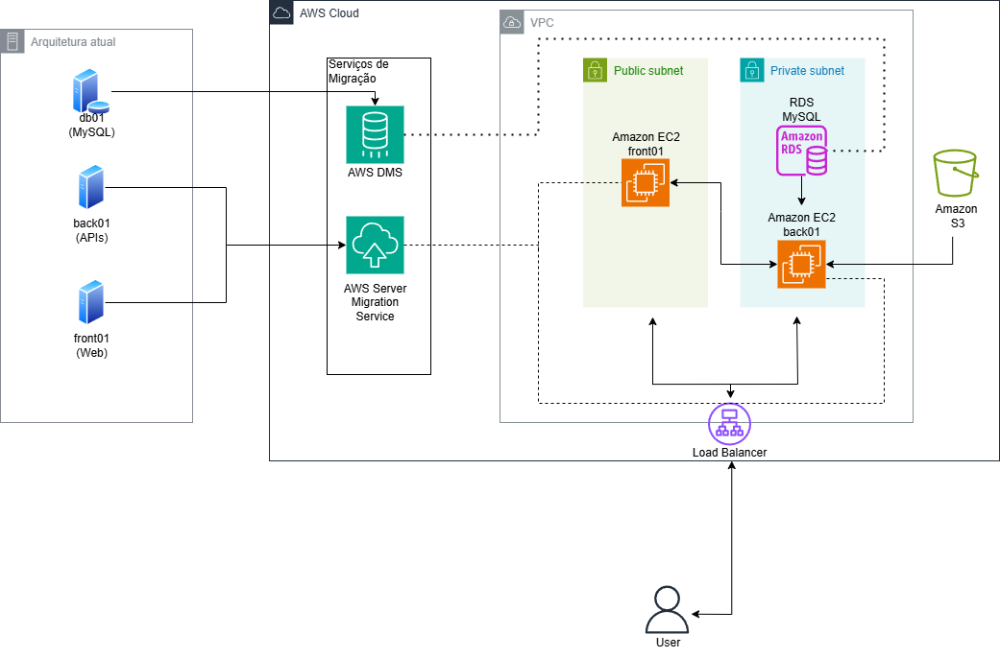
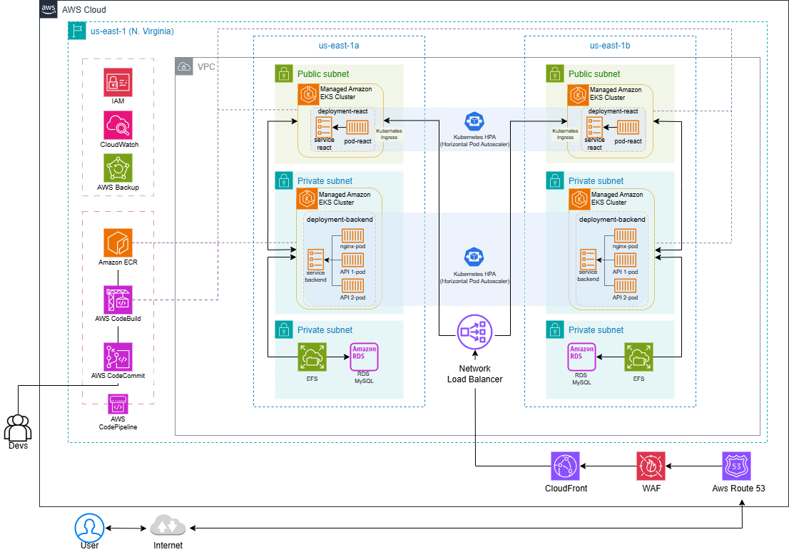

# Projeto-Final
-----
O projeto proposto pela equipe da Compass UOL  que consiste na migração de uma estrutura para o serviço AWS  , a início de forma **As-Is** e assim uma modernização posterior.

## Sumário
- [Introdução](#introdução)
- [Arquitetura Atual](#arquitetura-atual)
- [Arquitetura Proposta](#arquitetura-proposta)
- [Imagens de Referência](#imagens-de-referência)

## Introdução
Este documento detalha a transição de uma arquitetura legada para uma solução modernizada em AWS. A seguir, são apresentados os diagramas que ilustram a arquitetura atual e a proposta de modernização.

## Arquitetura Atual

A arquitetura atual consiste em uma aplicação monolítica, com os seguintes componentes:

- **db01 (MySQL)**: Servidor de banco de dados.
- **back01 (APIs)**: Servidor que hospeda as APIs.
- **front01 (Web)**: Servidor que hospeda a aplicação web.

### Processos de Migração
Os serviços AWS utilizados para a migração incluem:

- **AWS DMS (Database Migration Service)**: Para migração do banco de dados MySQL.
- **AWS Server Migration Service**: Para migração dos servidores front01 e back01.

#### Diagrama da Arquitetura Atual:

---

## Arquitetura Proposta

Na arquitetura modernizada, a aplicação é executada em um ambiente altamente escalável e gerenciado na AWS. Os principais componentes são:

- **Amazon EKS (Kubernetes Gerenciado)**: Hospeda a aplicação em clusters Kubernetes.
- **Amazon RDS**: Gerencia o banco de dados MySQL de forma escalável e resiliente.
- **EFS (Elastic File System)**: Disponibiliza armazenamento compartilhado para as instâncias do backend.
- **Network Load Balancer**: Faz a distribuição de tráfego para os pods em execução no cluster.
- **CloudFront, WAF e Route 53**: Gerenciam a distribuição global, segurança e roteamento DNS.

#### Diagrama da Arquitetura Proposta:

---

## Imagens de Referência

- **Arquitetura Atual:**
[Diagrama no Drawio (Arquitetura Atual)](https://viewer.diagrams.net/?tags=%7B%7D&lightbox=1&highlight=0000ff&edit=_blank&layers=1&nav=1&title=etapa1.drawio#Uhttps%3A%2F%2Fdrive.google.com%2Fuc%3Fid%3D1rNQtkXF_XuP33qqKmyob-6uMAzVxBKxZ%26export%3Ddownload)

- **Arquitetura Proposta:**
[Diagrama no Drawio (Arquitetura Proposta)](https://viewer.diagrams.net/?tags=%7B%7D&lightbox=1&highlight=0000ff&edit=_blank&layers=1&nav=1&title=etapa2.drawio#Uhttps%3A%2F%2Fdrive.google.com%2Fuc%3Fid%3D18OqixTgRhxT66cUyXdYqxdQq_Ym5w7XI%26export%3Ddownload)

---

## Cálculo de Custos

Para estimar os custos associados a esta arquitetura, utilize a [AWS Pricing Calculator](https://calculator.aws/#/). Essa ferramenta permite simular os custos de execução dos serviços utilizados, considerando diferentes níveis de utilização e requisitos.

 - **Estimativa de Custos As-is** 
[Calculadora Etapa 1]()
[Calculadora Etapa 2] (https://calculator.aws/#/estimate?id=2493cd5046425e78d778e102e19d3ea6bfcda855)
---

## Considerações Finais
A modernização para uma arquitetura baseada em Kubernetes e serviços gerenciados da AWS traz benefícios como escalabilidade, resiliência e eficiência operacional. Este documento serve como referência para implementação e futuras melhorias.

